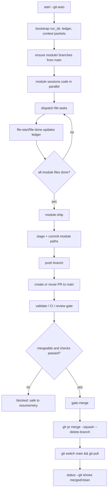

# Git Automation Plan

## Scope and grounding

This plan designs a built-in git automation layer for `tree-pipeline` without modifying current code. It is grounded in the existing orchestration and ledger flow:

- `Orchestrator.start()` initializes modules, ledger entries, context packets, and `run_manifest.json` ([pipeline/orchestrator.py](/Users/xiaowenjie/tree-pipeline/pipeline/orchestrator.py:163)-[215](/Users/xiaowenjie/tree-pipeline/pipeline/orchestrator.py:215)).
- `Orchestrator.dispatch_files()` fans a module into file-level sub-tasks and moves the module to `coding` ([pipeline/orchestrator.py](/Users/xiaowenjie/tree-pipeline/pipeline/orchestrator.py:432)-[509](/Users/xiaowenjie/tree-pipeline/pipeline/orchestrator.py:509)).
- `Orchestrator.validate()` is the current validation hook, but today it reports only failed modules and raises on test failures; it does not persist a dedicated git-ready signal for merge automation ([pipeline/orchestrator.py](/Users/xiaowenjie/tree-pipeline/pipeline/orchestrator.py:257)-[338](/Users/xiaowenjie/tree-pipeline/pipeline/orchestrator.py:338)).
- `TaskLedger` is append-only, supports idempotent same-state updates, blocking metadata, sub-task readiness, and resume-aware status recovery ([pipeline/task_ledger.py](/Users/xiaowenjie/tree-pipeline/pipeline/task_ledger.py:213)-[490](/Users/xiaowenjie/tree-pipeline/pipeline/task_ledger.py:490)).
- `SKILL.md` explicitly says git commit and PR flow are currently delegated to `prp-commit` / `git-workflow` rather than handled inside tree-pipeline ([SKILL.md](/Users/xiaowenjie/tree-pipeline/SKILL.md:56)-[68](/Users/xiaowenjie/tree-pipeline/SKILL.md:68)).

Open questions that should remain explicit until code implementation:

- Module naming convention is only defined as raw module names from CLI/config (`--module`, `modules.items[].name`); branch-name normalization from module name to `module/<name>` is not implemented today, so slugging rules must be chosen explicitly rather than assumed.
- "Validate passed" signaling is not yet persisted as a dedicated gate artifact or ledger flag; `validate()` currently returns failed modules or raises, which is enough for a CLI decision in one process but not a robust cross-session audit source.
- Expected `gh` authentication model is not defined in the repo; the implementation should document support for existing `gh auth status`, but whether the team uses `gh auth login`, `GITHUB_TOKEN`, or a machine user is unresolved.

## Integration Decision

Recommendation: build git automation directly into tree-pipeline, with a narrow internal wrapper in `pipeline/git_manager.py`, and keep external skill delegation only as an optional manual fallback.

Rationale:

- Resume safety depends on the same append-only task ledger that already drives `status`, `resume`, and file-level progression. A separate skill cannot reliably coordinate branch/PR state with `TaskLedger` unless tree-pipeline becomes a thin shell around that skill.
- The new CLI commands are part of the orchestrator contract, not generic git convenience. `start --git-auto`, `module-ship`, `gate-merge`, and `status --git` all need direct access to run manifests, module names, and ledger states.
- Idempotency is easier to guarantee in-process. Tree-pipeline can inspect ledger state, branch existence, PR existence, and validation state in one place before shelling out to `git` or `gh`.
- `SKILL.md`’s current delegation boundary made sense when tree-pipeline stopped at orchestration, but the requested architecture now makes git state part of pipeline state.

Why not keep delegation as the primary model:

- It splits responsibility for resumability across two systems.
- It weakens `--resume` compatibility because tree-pipeline would not own git side effects.
- It makes status reporting incomplete: `TaskLedger` can say a module is at `done`, while the branch and PR state live elsewhere.

Practical compromise:

- Built-in `GitManager` becomes the source of automation.
- `prp-commit` or `git-workflow` can still be recommended for manual intervention when automation hits a blocked or policy-rejected path.

## GitManager Module

File: `pipeline/git_manager.py`

Design principles:

- Use `subprocess.run(...)` only.
- Shell out to `git` and `gh` only; no GitPython, PyGithub, or other third-party wrappers.
- Return structured results, not raw stdout strings only.
- Make every public method safe to re-run.
- Prefer read-before-write logic: inspect current state first, then mutate only if needed.

### Supporting data structures

```python
from dataclasses import dataclass
from typing import Optional

@dataclass(slots=True)
class CommandResult:
    command: list[str]
    returncode: int
    stdout: str
    stderr: str

@dataclass(slots=True)
class BranchInfo:
    name: str
    exists_local: bool
    exists_remote: bool
    current: bool
    tracking: Optional[str]
    base_branch: str

@dataclass(slots=True)
class PullRequestInfo:
    number: Optional[int]
    url: Optional[str]
    state: str  # "OPEN", "MERGED", "CLOSED", "NONE"
    base_ref: Optional[str]
    head_ref: Optional[str]
    mergeable: Optional[str]  # gh may return MERGEABLE/CONFLICTING/UNKNOWN

@dataclass(slots=True)
class GitOperationResult:
    changed: bool
    message: str
    branch: Optional[BranchInfo] = None
    pr: Optional[PullRequestInfo] = None
```

### Class interface

```python
class GitManager:
    def __init__(
        self,
        *,
        repo_root: str,
        base_branch: str = "main",
        remote_name: str = "origin",
    ) -> None:
        """Bind git automation to one repository root and default base branch."""

    def ensure_clean_for_checkout(self) -> GitOperationResult:
        """Fail if tracked/untracked changes would make branch switches unsafe.

        Idempotency: read-only. Safe to call repeatedly.
        """

    def ensure_cli_available(self) -> GitOperationResult:
        """Verify `git` and `gh` are installed and callable.

        Idempotency: read-only. Safe to call repeatedly.
        """

    def ensure_gh_auth(self) -> GitOperationResult:
        """Verify GH CLI authentication is ready via `gh auth status`.

        Idempotency: read-only. Safe to call repeatedly.
        """

    def current_branch(self) -> str:
        """Return the current branch name via `git branch --show-current`.

        Idempotency: read-only.
        """

    def branch_info(self, branch: str) -> BranchInfo:
        """Inspect local/remote branch existence and tracking state.

        Idempotency: read-only.
        """

    def pr_info(self, *, head: str, base: Optional[str] = None) -> PullRequestInfo:
        """Inspect whether a PR already exists for head->base using `gh pr list/view`.

        Idempotency: read-only.
        """

    def checkout_base_and_pull(self, *, base_branch: Optional[str] = None) -> GitOperationResult:
        """Ensure the repository is on base branch and fast-forwarded from remote.

        Idempotency: if already on updated base, returns changed=False.
        """

    def ensure_module_branch(self, *, module: str, branch: str) -> GitOperationResult:
        """Create or reuse `branch` from base branch, then ensure upstream exists.

        Idempotency:
        - if local and remote branch already exist, reuse them;
        - if local exists but remote missing, push with upstream;
        - if neither exists, create from fresh base and push;
        - never recreate or reset an existing branch.
        """

    def working_tree_status(self, *, pathspecs: Optional[list[str]] = None) -> GitOperationResult:
        """Return porcelain status for whole repo or a scoped path set.

        Idempotency: read-only.
        """

    def has_uncommitted_changes(self, *, pathspecs: Optional[list[str]] = None) -> bool:
        """Return True when the target scope has tracked or untracked changes.

        Idempotency: read-only.
        """

    def commit_paths(
        self,
        *,
        message: str,
        pathspecs: Optional[list[str]] = None,
    ) -> GitOperationResult:
        """Stage and commit changes if and only if there is something new to commit.

        Idempotency:
        - if target scope is clean, return changed=False and do not create an empty commit;
        - if the same commit was already created and nothing changed since, re-run is a no-op.
        """

    def push_branch(self, *, branch: Optional[str] = None, set_upstream: bool = True) -> GitOperationResult:
        """Push current or named branch to remote, creating upstream if required.

        Idempotency:
        - if branch is already up to date, returns changed=False;
        - if upstream exists, plain push;
        - if upstream missing, push with `-u`.
        """

    def ensure_pr(
        self,
        *,
        branch: str,
        title: str,
        body: str,
        base_branch: Optional[str] = None,
    ) -> GitOperationResult:
        """Create a PR if none exists, otherwise return the existing PR.

        Idempotency:
        - lookup by head/base before create;
        - if an open PR already exists, reuse it;
        - if a merged PR exists for the branch, do not create a duplicate.
        """

    def check_merge_conflicts(self, *, branch: str, base_branch: Optional[str] = None) -> GitOperationResult:
        """Detect likely merge conflicts before merge using fetch + merge-base checks and/or GH mergeability.

        Idempotency: read-only.
        """

    def merge_pr(
        self,
        *,
        pr: str,
        merge_strategy: str = "squash",
        delete_branch: bool = True,
        require_ci_pass: bool = True,
    ) -> GitOperationResult:
        """Merge a PR through GitHub CLI, then refresh local base branch.

        Idempotency:
        - if the PR is already merged, do not merge again; just refresh local base;
        - if delete_branch is true and branch is already deleted, treat as success;
        - if required checks are not green and require_ci_pass is true, return a blocked result.
        """

    def delete_branch(self, *, branch: str, delete_remote: bool = True) -> GitOperationResult:
        """Delete local and optional remote branch when safe.

        Idempotency:
        - if branch is already absent locally/remotely, return changed=False;
        - never delete the base branch;
        - never force-delete unmerged local work.
        """

    def aggregate_module_status(self, *, branches: list[str]) -> list[dict]:
        """Return branch/PR/mergeability snapshots for status dashboards.

        Idempotency: read-only.
        """
```

### Exact shell commands per operation

`ensure_cli_available`

```bash
git --version
gh --version
```

`ensure_gh_auth`

```bash
gh auth status
```

`current_branch`

```bash
git branch --show-current
```

`branch_info`

```bash
git show-ref --verify --quiet refs/heads/<branch>
git ls-remote --exit-code --heads origin <branch>
git rev-parse --abbrev-ref <branch>@{upstream}
```

`checkout_base_and_pull`

```bash
git status --porcelain
git fetch origin --prune
git switch <base_branch>
git pull --ff-only origin <base_branch>
```

`ensure_module_branch`

```bash
git fetch origin --prune
git show-ref --verify --quiet refs/heads/<branch>
git ls-remote --exit-code --heads origin <branch>
git switch <base_branch>
git pull --ff-only origin <base_branch>
git switch -c <branch>
git switch <branch>
git push -u origin <branch>
```

`working_tree_status`

```bash
git status --porcelain
git status --porcelain -- <pathspec...>
```

`commit_paths`

```bash
git status --porcelain -- <pathspec...>
git add -- <pathspec...>
git diff --cached --quiet -- <pathspec...>
git commit -m "<message>"
```

`push_branch`

```bash
git push
git push -u origin <branch>
```

`pr_info`

```bash
gh pr list --state open --head <branch> --base <base_branch> --json number,url,state,headRefName,baseRefName
gh pr view <branch> --json number,url,state,headRefName,baseRefName,mergeable
```

`ensure_pr`

```bash
gh pr list --state open --head <branch> --base <base_branch> --json number,url,state,headRefName,baseRefName
gh pr create --base <base_branch> --head <branch> --title "<title>" --body "<body>"
gh pr view <branch> --json number,url,state,headRefName,baseRefName,mergeable
```

`check_merge_conflicts`

```bash
git fetch origin --prune
git merge-tree "$(git merge-base origin/<base_branch> origin/<branch>)" origin/<base_branch> origin/<branch>
gh pr view <branch> --json mergeable
```

`merge_pr`

```bash
gh pr view <pr> --json number,state,mergeable,statusCheckRollup,headRefName,baseRefName
gh pr merge <pr> --squash --delete-branch
git switch <base_branch>
git pull --ff-only origin <base_branch>
```

If merge strategy is configurable:

```bash
gh pr merge <pr> --merge --delete-branch
gh pr merge <pr> --rebase --delete-branch
```

`delete_branch`

```bash
git branch --list <branch>
git branch -d <branch>
git push origin --delete <branch>
```

## Idempotency and error strategy

The automation layer should treat git operations as state reconciliation, not blind command execution.

### Error cases and handling

`branch already exists`

- Detect first with `git show-ref` and `git ls-remote`.
- Reuse the branch instead of recreating it.
- If local exists on a different commit than remote, do not reset; surface divergence and require manual resolution.

`PR already exists`

- Detect with `gh pr list --state open --head ... --base ...`.
- Return the existing PR number and URL.
- If multiple open PRs exist for the same head/base, mark blocked and require manual cleanup.

`merge conflicts`

- Detect via `gh pr view ... --json mergeable` and optionally `git merge-tree`.
- `gate-merge` must refuse to merge when mergeability is `CONFLICTING`.
- Record or print a resumable blocked reason rather than attempting auto-resolution.

`uncommitted changes`

- `module-ship` stages only declared module paths if the repository is otherwise clean enough to avoid unrelated changes.
- If unrelated dirty files exist outside the target module scope, default behavior should be block-and-report, not auto-commit them.

`dirty working tree during checkout`

- Any branch-switching method must run `git status --porcelain` first.
- If switching branches would risk carrying uncommitted changes across modules, stop and return a blocking error.

`remote not reachable`

- Treat network or auth failures from `git fetch`, `git push`, or `gh` calls as retryable.
- Do not mark ledger progress forward until the remote side effect is confirmed.

`already merged / already deleted`

- `merge_pr()` should inspect PR state first.
- `delete_branch()` should tolerate missing local or remote branches.
- `gate-merge` should still end by refreshing local `main`.

### Resume compatibility

Current `resume()` auto-unblocks ledger tasks whose dependencies are now satisfied ([pipeline/orchestrator.py](/Users/xiaowenjie/tree-pipeline/pipeline/orchestrator.py:217)-[244](/Users/xiaowenjie/tree-pipeline/pipeline/orchestrator.py:244)). Git automation should follow the same philosophy:

- never assume an operation needs to run just because a command was requested;
- first inspect current git/PR state;
- if the desired state already exists, return success without mutation;
- if a previous attempt partially succeeded, complete only the missing tail step.

Recommended ledger metadata additions for a later implementation:

```json
{
  "git": {
    "branch": "module/auth",
    "branch_pushed": true,
    "pr_number": 42,
    "pr_url": "https://github.com/org/repo/pull/42",
    "pr_state": "OPEN",
    "merge_checked_at": "2026-05-07T00:00:00Z",
    "merge_status": "clean"
  }
}
```

This fits the existing `TaskEntry.meta` append-only snapshot model ([pipeline/task_ledger.py](/Users/xiaowenjie/tree-pipeline/pipeline/task_ledger.py:95)-[166](/Users/xiaowenjie/tree-pipeline/pipeline/task_ledger.py:166), [314](/Users/xiaowenjie/tree-pipeline/pipeline/task_ledger.py:314)-[364](/Users/xiaowenjie/tree-pipeline/pipeline/task_ledger.py:364)).

## CLI extensions

Existing CLI entrypoints are defined in `main()` with subparsers for `start`, `status`, `resume`, `validate`, `dispatch`, `file-start`, `file-done`, `module-check`, and `next` ([pipeline/orchestrator.py](/Users/xiaowenjie/tree-pipeline/pipeline/orchestrator.py:745)-[922](/Users/xiaowenjie/tree-pipeline/pipeline/orchestrator.py:922)). The git automation layer should extend that CLI rather than creating a separate binary.

### 1. `start --git-auto`

Proposed signature:

```bash
python3 -m pipeline.orchestrator start \
  --project-root <repo> \
  --run-dir <run-dir> \
  --module <name>... \
  --edge <dependent:dependency>... \
  --git-auto
```

Arguments:

| Argument         | Required | Meaning                                         |
| ---------------- | -------- | ----------------------------------------------- |
| `--project-root` | yes      | repo root for git commands                      |
| `--run-dir`      | yes      | tree-pipeline run directory                     |
| `--module`       | no       | module list; falls back to config               |
| `--edge`         | no       | dependency edges                                |
| `--git-auto`     | no       | create/push module branches after run bootstrap |

Behavior:

- Run existing `start()` first.
- Resolve module list from CLI/config using current logic ([pipeline/orchestrator.py](/Users/xiaowenjie/tree-pipeline/pipeline/orchestrator.py:807)-[857](/Users/xiaowenjie/tree-pipeline/pipeline/orchestrator.py:857)).
- For each module, compute `module/<branch-suffix>`.
- Call `GitManager.ensure_module_branch(...)`.
- Return a table of `module -> branch`.

Exact shell-outs after `start()`:

```bash
git fetch origin --prune
git switch main
git pull --ff-only origin main
git switch -c module/<name>
git push -u origin module/<name>
```

Idempotency:

- Re-running `start --git-auto` for the same run should not recreate branches.
- If the run directory already exists and branches already exist, the command returns the existing mapping.

### 2. `module-ship <module>`

Proposed signature:

```bash
python3 -m pipeline.orchestrator module-ship \
  --run-dir <run-dir> \
  --project-root <repo> \
  --module <name> \
  [--commit-message "Module: <name>"] \
  [--pr-title "Module: <name>"] \
  [--pr-body-file <path>]
```

Arguments:

| Argument           | Required | Meaning                            |
| ------------------ | -------- | ---------------------------------- |
| `--run-dir`        | yes      | pipeline run directory             |
| `--project-root`   | yes      | repo root                          |
| `--module`         | yes      | module name from ledger            |
| `--commit-message` | no       | commit subject override            |
| `--pr-title`       | no       | PR title override                  |
| `--pr-body-file`   | no       | body template file; else generated |

Behavior:

- Validate that the module exists in the ledger created by `create_tasks()` ([pipeline/task_ledger.py](/Users/xiaowenjie/tree-pipeline/pipeline/task_ledger.py:213)-[248](/Users/xiaowenjie/tree-pipeline/pipeline/task_ledger.py:248)).
- Refuse to ship if file sub-tasks are not all done, using `all_sub_tasks_done(module)` ([pipeline/task_ledger.py](/Users/xiaowenjie/tree-pipeline/pipeline/task_ledger.py:470)-[476](/Users/xiaowenjie/tree-pipeline/pipeline/task_ledger.py:476)).
- Refuse to ship if the working tree contains unrelated dirty files.
- Stage module-owned paths, commit if needed, push branch, then create or reuse the PR.

Exact shell-outs:

```bash
git switch module/<name>
git status --porcelain
git add -- <module-pathspecs...>
git diff --cached --quiet -- <module-pathspecs...>
git commit -m "Module: <name>"
git push -u origin module/<name>
gh pr list --state open --head module/<name> --base main --json number,url,state,headRefName,baseRefName
gh pr create --base main --head module/<name> --title "Module: <name>" --body "<generated body>"
```

PR body should include:

- module name
- run dir
- changed files summary
- ledger summary
- validation status if available
- open risks

Idempotency:

- If no new changes exist, skip commit and still ensure push/PR.
- If the PR already exists, return it instead of creating another.

### 3. `gate-merge <module|PR>`

Proposed signature:

```bash
python3 -m pipeline.orchestrator gate-merge \
  --run-dir <run-dir> \
  --project-root <repo> \
  --module <name>
```

or

```bash
python3 -m pipeline.orchestrator gate-merge \
  --project-root <repo> \
  --pr 123
```

Arguments:

| Argument              | Required    | Meaning                                              |
| --------------------- | ----------- | ---------------------------------------------------- |
| `--run-dir`           | conditional | needed for module lookup and ledger context          |
| `--project-root`      | yes         | repo root                                            |
| `--module`            | conditional | merge by module branch                               |
| `--pr`                | conditional | merge by PR number/url                               |
| `--force-no-ci-check` | no          | bypass config `require_ci_pass`; admin-only behavior |

Behavior:

- Resolve PR from module branch if `--module` is used.
- Check PR state, mergeability, and CI state.
- If allowed, merge with configured strategy, delete branch when configured, then refresh local `main`.

Exact shell-outs:

```bash
gh pr view <pr-or-branch> --json number,state,mergeable,statusCheckRollup,headRefName,baseRefName,url
gh pr merge <pr-or-branch> --squash --delete-branch
git switch main
git pull --ff-only origin main
```

Idempotency:

- If already merged, skip merge and just refresh local `main`.
- If branch deletion already happened remotely, still succeed.

Validation rule:

- The current repo does not persist a first-class "validate passed" marker. Until that exists, `gate-merge` should treat the following as the source of truth:
  - GitHub required checks if `require_ci_pass: true`
  - optional local re-run of `validate` if the team wants a pre-merge local check

This is an open design point, not something the current code already solves.

### 4. `status --git`

Proposed signature:

```bash
python3 -m pipeline.orchestrator status --run-dir <run-dir> --git
```

Arguments:

| Argument    | Required | Meaning                                   |
| ----------- | -------- | ----------------------------------------- |
| `--run-dir` | yes      | pipeline run directory                    |
| `--git`     | no       | enrich dashboard output with git/PR state |

Behavior:

- Keep existing dashboard rendering behavior.
- Add a git status table for each module:
  - branch name
  - local branch exists
  - remote branch exists
  - PR number/url/state
  - mergeability
  - dirty working tree warning if current branch matches module branch

Exact shell-outs:

```bash
git show-ref --verify --quiet refs/heads/module/<name>
git ls-remote --exit-code --heads origin module/<name>
gh pr list --state open --head module/<name> --base main --json number,url,state,headRefName,baseRefName
gh pr view module/<name> --json number,url,state,mergeable,statusCheckRollup
```

## Flow diagram



## Config schema additions

Add a top-level `git:` section to `pipeline.config.yaml`.

```yaml
git:
  auto_create_pr: false
  merge_strategy: squash
  auto_delete_branch: true
  require_ci_pass: true
  base_branch: main
```

Suggested resolved config fields:

```python
@dataclass(slots=True)
class GitConfig:
    auto_create_pr: bool
    merge_strategy: str  # "squash" | "merge" | "rebase"
    auto_delete_branch: bool
    require_ci_pass: bool
    base_branch: str
```

Intended semantics:

- `auto_create_pr`: if true, `module-ship` creates the PR automatically; if false, it can stop after push unless the command explicitly requests PR creation.
- `merge_strategy`: default merge mode used by `gate-merge`.
- `auto_delete_branch`: whether merged branches should be deleted remotely and locally.
- `require_ci_pass`: whether `gate-merge` requires GitHub checks to be green before merge.
- `base_branch`: default integration branch; should default to `main`.

Validation rules:

- `merge_strategy` must be one of `squash`, `merge`, `rebase`.
- `base_branch` must be non-empty.

## Mapping to current code paths

Recommended integration points:

- `resolve_config()` in [pipeline/orchestrator.py](/Users/xiaowenjie/tree-pipeline/pipeline/orchestrator.py:117)-[150](/Users/xiaowenjie/tree-pipeline/pipeline/orchestrator.py:150):
  add parsing for a new `GitConfig`, parallel to the existing command/config resolution model.
- `main()` CLI parser in [pipeline/orchestrator.py](/Users/xiaowenjie/tree-pipeline/pipeline/orchestrator.py:745)-[922](/Users/xiaowenjie/tree-pipeline/pipeline/orchestrator.py:922):
  add `--git-auto` to `start`, add new subcommands `module-ship` and `gate-merge`, and add `--git` to `status`.
- `Orchestrator.start()` in [pipeline/orchestrator.py](/Users/xiaowenjie/tree-pipeline/pipeline/orchestrator.py:163)-[215](/Users/xiaowenjie/tree-pipeline/pipeline/orchestrator.py:215):
  after the run bootstrap finishes, optionally call `GitManager.ensure_module_branch()` for each module.
- `TaskLedger` in [pipeline/task_ledger.py](/Users/xiaowenjie/tree-pipeline/pipeline/task_ledger.py:266)-[295](/Users/xiaowenjie/tree-pipeline/pipeline/task_ledger.py:266) and [368](/Users/xiaowenjie/tree-pipeline/pipeline/task_ledger.py:368)-[476](/Users/xiaowenjie/tree-pipeline/pipeline/task_ledger.py:476):
  keep status transitions as-is, but add git metadata snapshots in `meta` rather than inventing a separate persistence file.

Important boundary:

- `dispatch` and file-level worker flow stay unchanged; git automation begins at module-branch setup and module shipping, not at the per-file worker layer.

## Implementation order

### Phase 1: GitManager foundation

Build:

- `pipeline/git_manager.py`
- command runner helper
- read-only inspections: CLI availability, auth status, branch info, PR info, working tree status

Verification:

- Unit tests with mocked `subprocess.run`
- confirm branch/PR detection works for "exists", "missing", "auth failure", and "remote unavailable"
- confirm every read-only method is re-runnable with identical output semantics

### Phase 2: Idempotent branch lifecycle

Build:

- `checkout_base_and_pull()`
- `ensure_module_branch()`
- `push_branch()`
- `delete_branch()`

Verification:

- create branch when absent
- reuse branch when present
- push upstream when remote missing
- no destructive reset on divergence
- refuse unsafe checkout on dirty tree

### Phase 3: Commit and PR automation

Build:

- `commit_paths()`
- `ensure_pr()`
- PR body generator from module name, run dir, and ledger summary

Verification:

- no-op when no changes
- create commit when changes exist
- reuse existing PR
- detect multiple PRs as blocked
- ensure exact `gh pr create --base main --head module/<name> ...` path is covered

### Phase 4: CLI integration

Build:

- `start --git-auto`
- `module-ship`
- `status --git`

Verification:

- `start --git-auto` returns stable module-to-branch mapping on repeated runs
- `module-ship` refuses to proceed when `all_sub_tasks_done(module)` is false
- `status --git` renders git and PR state without changing repo state

### Phase 5: Merge gate automation

Build:

- `gate-merge`
- CI/mergeability checks
- local `main` refresh after merge

Verification:

- merge succeeds when PR is open and green
- merge no-ops when PR is already merged
- merge blocks on conflicting PR
- local `main` is refreshed after success or already-merged state

### Phase 6: Ledger enrichment and roadmap updates

Build:

- write git metadata snapshots into `TaskEntry.meta`
- teach `status --git` to merge ledger and live git state
- update architecture roadmap to mention git automation

Verification:

- repeated operations append coherent snapshots rather than overwriting history
- `resume` remains compatible because git state can be recomputed from repo plus latest ledger snapshot

## ARCHITECTURE.md update plan

When implementation work begins, extend the `Implementation Roadmap` section in `ARCHITECTURE.md` with:

- a step for configuring `git:` in `pipeline.config.yaml`
- a step for enabling `start --git-auto` branch bootstrap
- a step for `module-ship` PR creation conventions
- a step for `gate-merge` operating as the `main` branch acceptance path
- a step for `status --git` dashboards and merge queue monitoring

No architecture rewrite is needed; this is a roadmap augmentation, because the current architecture already defines module branches and a `main` gate.

## Recommended defaults

- Use built-in git automation as the primary path.
- Default branch naming target: `module/<module-name>` after explicit normalization rules are chosen.
- Default merge strategy: `squash`.
- Default delete-branch behavior: enabled.
- Default CI gate requirement: enabled.
- Default failure mode: block and report, never auto-resolve conflicts or auto-stash unrelated changes.
